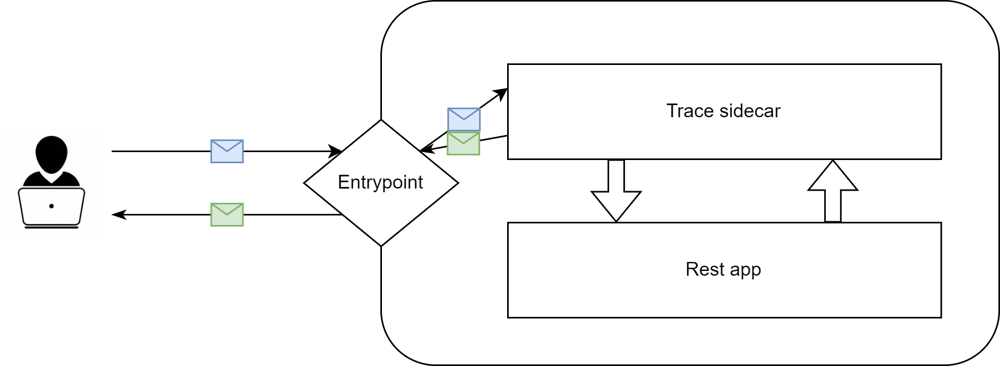
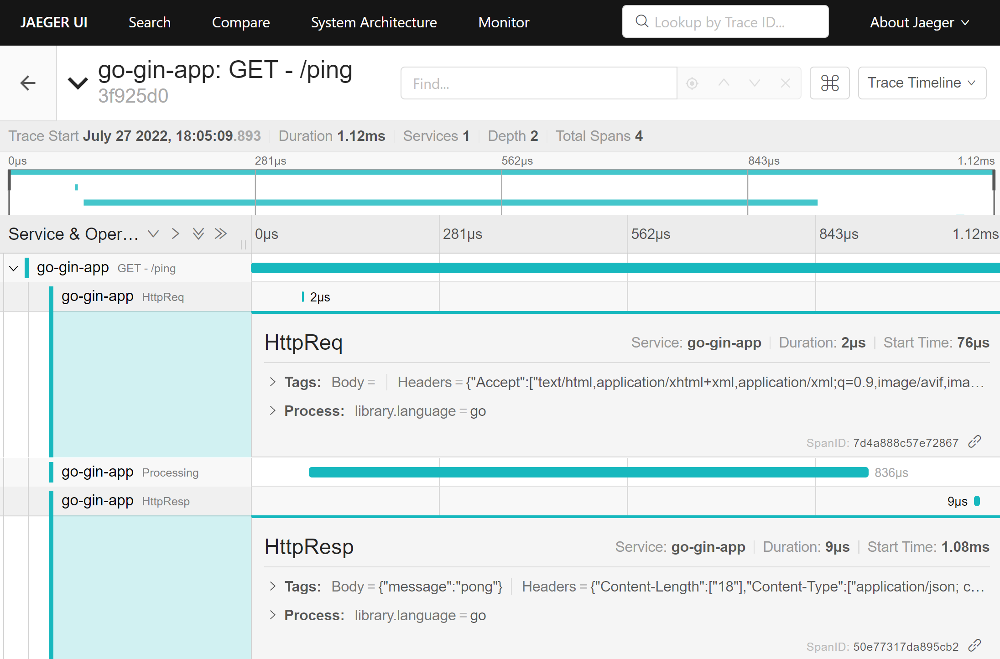

# [Opentelemetry] Apply Jaeger on REST container for free

As the title want to intend this little go application can be usefull to trace http-level info in jaeger.

## Overview

It is just an http proxy that will trace the http calls (header, uri, body and so on). This will not inject anything in your code so basically can be used for everything (maybe not).

As per the diagram below this *Trace sidecar* has to be in front of the real app. 



## Configuration

The enviroment variables to set:

```yaml
- name: LISTEN_AND_SERVE
  value: ':8080'  # The port where proxy will listen
- name: REDIRECT_TO
  value: 'http://myapp:8081'  # The endpoint where the requests will be redirected
- name: SERVICE_NAME
  value: go-gin-app  # An arbitrary name to your app - Used in traces
- name: INSECURE_MODE
  value: 'true'
- name: OTEL_EXPORTER_OTLP_ENDPOINT
  value: 'jaegertracing:4317'  # The opentelemetry endpoint
```

## Limits

- Putting a middle ware between client and server you are loosing the real client info (client ip, client port and so on). You can pass those info as custom header to workaround this limit
- Currently support only HTTP protocol

*… so far is good enough for my usage, i didn’t see any other limit*

## Example

**Environment:** Kubernetes cluster with [*jaeger-all-in-one*](https://www.jaegertracing.io/docs/1.36/getting-started/) up and running and a simple webapp (golang-gin) exposing the endpoint */ping*

The trace are composed like a so:

- Http transaction “GET - /ping”
    - Http request “HttpReq” - contains payload, request headers and uri
    - Client processing “Processing” - no tags, used just for the elapsed time
    - Http response “HttpResp” - contains response body, response headers and http status



In case of error still trace the request with status !200


